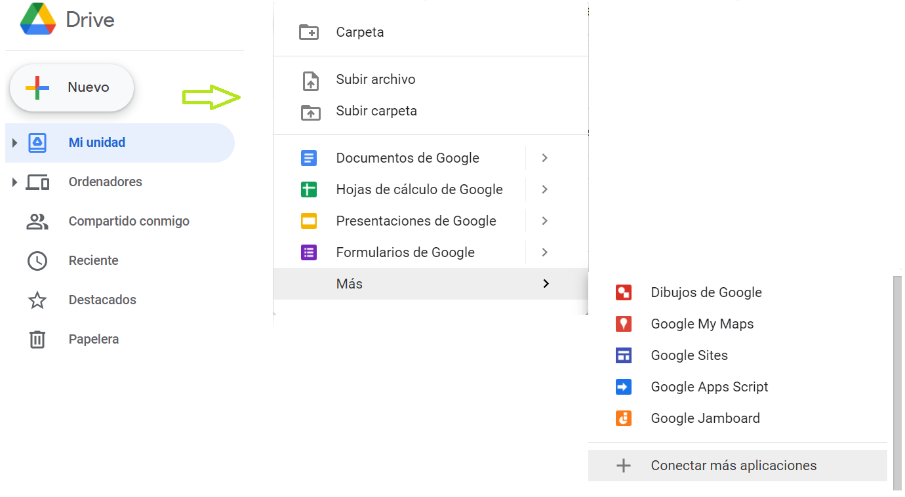

# Taller III
Introducción al Análisis de datos con Python
## Instrucciones para preparación de entorno
- Entrar a [google drive](https://drive.google.com)
- Agregar la aplicación *colaboratory* a google drive
- Presionar Nuevo -> Más -> Conectar más Aplicaciones -> escribir colaboratory en el buscador
- Finalmente, Crear un nuevo Notebook colab

   

   

## Referencias
**[1]** Numpy  - [Documentación Oficial](https://numpy.org/)  
**[2]** Pandas - [Documentación Oficial](https://pandas.pydata.org/docs/user_guide/index.html)  
**[3]** Matplotlib - [Documentación oficial](https://matplotlib.org/stable/contents.html)  
**[4]** Markdown - [Documentación oficial](https://www.markdownguide.org/basic-syntax/)  
**[5]** Google colaboratory - [Documentación oficial](https://colab.research.google.com)  
**[6]** Proyecto Jupyter - [Documentación oficial](https://jupyter.org/documentation)